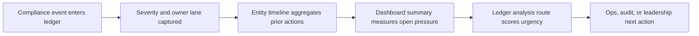
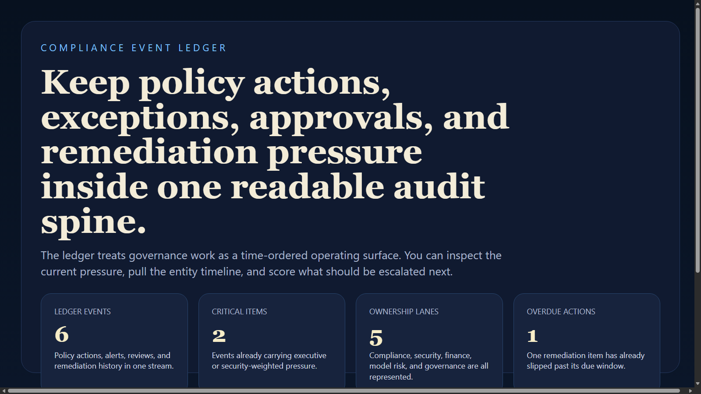
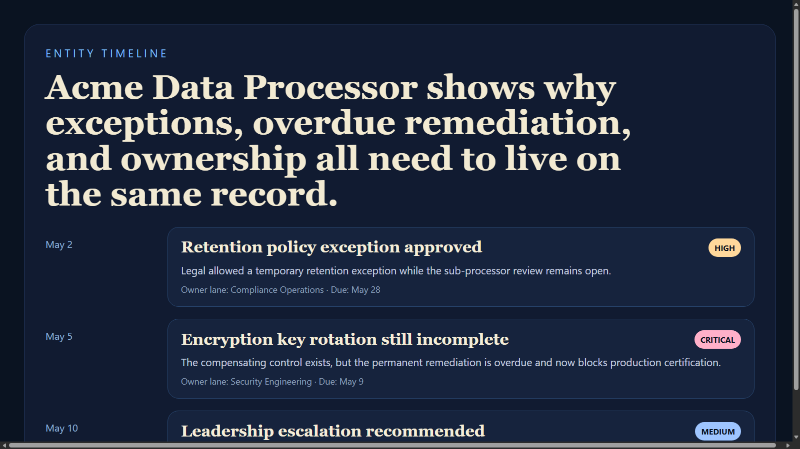
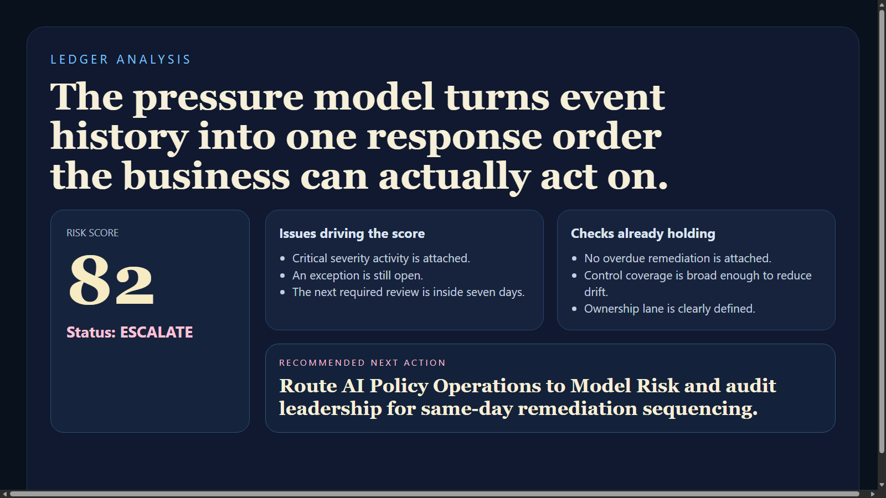
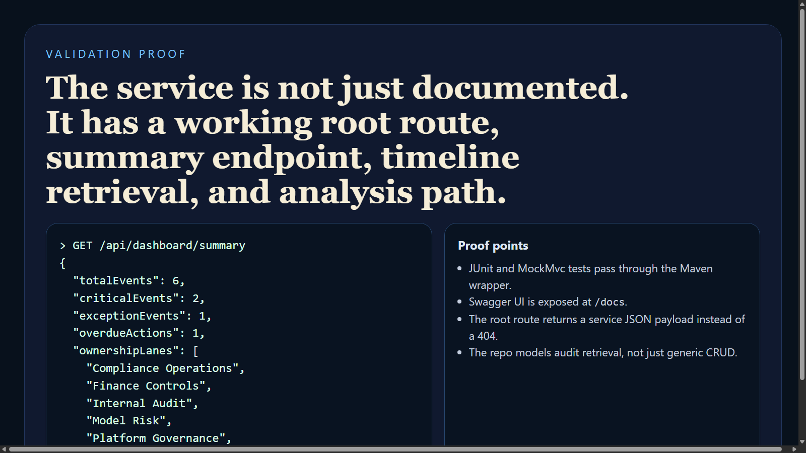

# Compliance Event Ledger

Compliance Event Ledger is a Java and Spring Boot service for tracking policy actions, approvals, exceptions, remediations, and review pressure in one audit-friendly event stream. It models governance activity as a time-ordered ledger instead of a loose pile of tickets, which makes ownership, severity, and deadline pressure much easier to inspect.

## Executive Summary

This project shows how governance data can be structured as an operational timeline instead of static reporting. Each event captures severity, ownership lane, tags, due dates, and status so teams can retrieve a single event, inspect an entity timeline, summarize the current ledger, and run a pressure analysis when an entity looks unstable.

## Portfolio Takeaway

- Java and Spring Boot backend with opinionated governance domain modeling
- timeline retrieval for audit review and entity-centric investigation
- severity-aware analysis route for escalation and next-step sequencing
- clean docs, tests, CI, and public proof assets

## Overview

| Area | Details |
| --- | --- |
| Language | Java 21 |
| Framework | Spring Boot 3.5 |
| API Docs | Swagger UI at `/docs` |
| Test Stack | JUnit 5, Spring Boot Test, MockMvc |
| Runtime Shape | In-memory event ledger with analysis service |
| Core Domains | policy actions, approvals, exceptions, remediations, reviews, alerts |

## API Surface

- `GET /`
- `GET /health`
- `GET /api/events`
- `GET /api/events/{id}`
- `GET /api/timeline/{entityId}`
- `GET /api/dashboard/summary`
- `POST /api/analyze/ledger`
- `GET /docs`

## Request Flow



## Analysis Logic

The analysis route treats governance pressure as a weighted combination of:

- highest active severity
- open exceptions
- overdue remediation work
- days until the next required review
- control coverage strength

That produces a score, status, issues, passed checks, and a recommended next action.

## Sample Analysis

Request:

```json
{
  "entityName": "AI Policy Operations",
  "ownerLane": "Model Risk",
  "highestSeverity": "CRITICAL",
  "daysUntilReview": 3,
  "hasOpenException": true,
  "hasOverdueRemediation": false,
  "activeControls": [
    "approval-history",
    "exception-register"
  ]
}
```

Response:

```json
{
  "status": "escalate",
  "score": 82,
  "issues": [
    "Critical severity activity is attached to this entity.",
    "An exception is still open and requires ownership validation.",
    "The next mandatory review is inside a seven-day window."
  ],
  "passedChecks": [
    "No overdue remediation is currently attached.",
    "Control coverage is broad enough to reduce uncontrolled drift."
  ],
  "recommendedNextAction": "Route to Model Risk and audit leadership for same-day remediation sequencing."
}
```

## Screenshots

### Control Room


### Entity Timeline


### Ledger Analysis


### Validation Proof


## Run Locally

```powershell
Set-Location "C:\Users\chaus\dev\repos\compliance-event-ledger"
$env:JAVA_HOME = "C:\Program Files\Microsoft\jdk-21.0.11.10-hotspot"
$env:Path = "$env:JAVA_HOME\bin;$env:Path"
.\mvnw.cmd spring-boot:run
```

Then open:

- `http://127.0.0.1:4311/`
- `http://127.0.0.1:4311/docs`

If that port is already occupied, choose another one before running:

```powershell
$env:PORT = "4315"
.\mvnw.cmd spring-boot:run
```

## Validation

```powershell
Set-Location "C:\Users\chaus\dev\repos\compliance-event-ledger"
$env:JAVA_HOME = "C:\Program Files\Microsoft\jdk-21.0.11.10-hotspot"
$env:Path = "$env:JAVA_HOME\bin;$env:Path"
.\mvnw.cmd test
.\mvnw.cmd package
```

## Tech Stack

[](https://www.oracle.com/java/)
[](https://spring.io/projects/spring-boot)
[](https://swagger.io/specification/)
[](https://junit.org/junit5/)
[](https://maven.apache.org/)

## Portfolio Links

- [Kinetic Gain](https://kineticgain.com/)
- [LinkedIn](https://www.linkedin.com/in/mirzacausevic)
- [Skills Page](https://mizcausevic.com/skills/)
- [Medium](https://medium.com/@mizcausevic)
- [GitHub](https://github.com/mizcausevic-dev)
