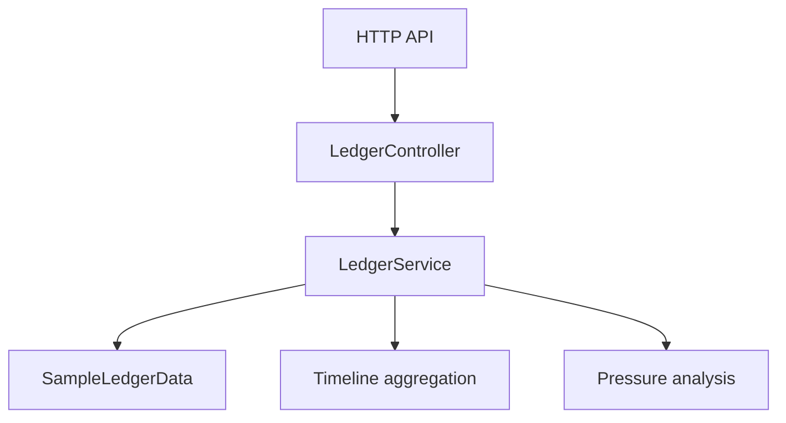

# Architecture

Compliance Event Ledger is structured as a Spring Boot service with three main responsibilities:

1. store and retrieve immutable-style governance events
2. aggregate events by entity into an auditable timeline
3. score active governance pressure into an operational next step

## Components

## Domain Objects

- `ComplianceEvent`
- `DashboardSummary`
- `TimelineView`
- `LedgerAnalysisInput`
- `LedgerAnalysisResponse`

## Event Categories

- policy action
- approval
- exception
- remediation
- review
- alert

## Pressure Model

The analysis score is increased by:

- critical or high severity activity
- open exception presence
- overdue remediation
- short review windows
- thin control coverage

The score is reduced slightly when the entity already has multiple meaningful controls attached.

## Why This Shape Works

This design keeps the repo believable as a backend artifact. It shows audit retrieval, operational scoring, and governance decisioning without pretending to be a full persistence or workflow platform.
