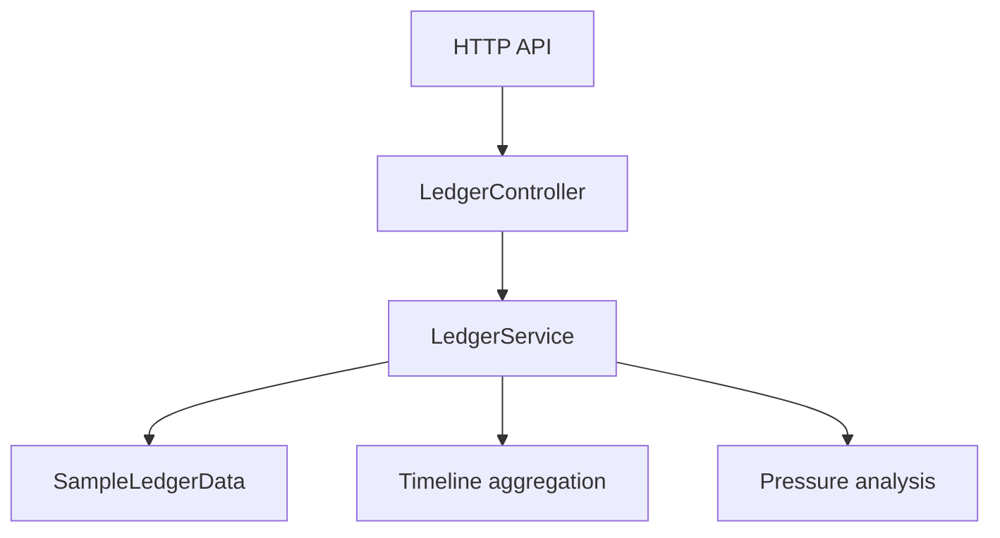

# Architecture

Compliance Event Ledger is structured as a Spring Boot service with three main responsibilities:

1. retrieve bundled synthetic governance events from memory
2. aggregate those events by entity into a sample timeline
3. score active governance pressure into an operational next step

## Components

```mermaid
flowchart TD
  A["HTTP API"] --> B["LedgerController"]
  B --> C["LedgerService"]
  C --> D["SampleLedgerData"]
  C --> E["Timeline aggregation"]
  C --> F["Pressure analysis"]
```

## Domain Objects

- `ComplianceEvent`
- `DashboardSummary`
- `TimelineView`
- `LedgerAnalysisInput`
- `LedgerAnalysisResponse`

## Event Categories

- policy action
- approval
- exception
- remediation
- review
- alert

## Pressure Model

The analysis score is increased by:

- critical or high severity activity
- open exception presence
- overdue remediation
- short review windows
- thin control coverage

The score is reduced slightly when the entity already has multiple meaningful controls attached.

## Why This Shape Works

This design demonstrates timeline retrieval and operational scoring. It does not persist events or provide audit-grade integrity.
